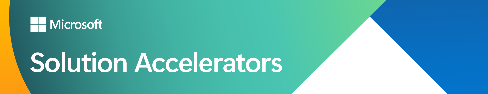

# Solution Accelerator Repository

This is a central hub for solution accelerators that are pre-built, open-source solutions designed to accelerate proof of value. They provide a starting point for the most common scenarios and are adaptable to partners' and customers' business needs. 

## AI Solution Accelerators

### Chat with your data
Users can chat with their own data by combining Azure Cognitive Search and Large Language Models (LLMs) to create a conversational search experience. It enables increased user efficiency by minimizing endpoints required to access internal company knowledgebases.
- [Solution Accelerator](https://github.com/Azure-Samples/chat-with-your-data-solution-accelerator)

### Build your own copilot
Users can see in action how to create their own copilots using Azure OpenAI Service, Azure AI Search, and Microsoft Fabric. The repository includes reusable architecture, code snippets, and deployment scripts to help accelerate AI projects.

#### Client Advisor
This copilot helps client advisors to save time and prepare relevant discussion topics for scheduled meetings. It provides an overview of daily client meetings with seamless navigation between viewing client profiles and chatting with structured data. Altogether, these features streamline meeting preparation for the advisors and result in more productive conversations with clients.
- [Solution Accelerator](https://github.com/microsoft/Build-your-own-copilot-Solution-Accelerator?tab=readme-ov-file#client-advsior)
  
#### Researcher
This copilot helps the researchers find relevant articles and grants available for their research topic easily using a conversational assistant. Researcher can generate different sections of a grant application with a simple button click, then they can refine the prompts and regenerate individual sections to add more details as needed. Finally, the generated grant application can be exported as a PDF or a Microsoft Word document for further processing.
- [Solution Accelerator](https://github.com/microsoft/Build-your-own-copilot-Solution-Accelerator?tab=readme-ov-file#research-assistant)

#### Document Generation
This copilot is a powerful tool that helps you create your own AI assistant(s). The accelerator can be used by any customer looking for reusable architecture and code snippets to build an AI assistant(s) with their own enterprise data. It leverages Azure Open AI Service and Azure AI Search, to identify relevant documents, summarize unstructured information, and generate Word document templates using your own data.
- [Solution Accelerator](https://github.com/microsoft/Generic-Build-your-own-copilot-Solution-Accelerator)  

### Knowledge Mining
Users can see how to accelerate decision making at scale with intelligence that uncovers insights, relationships, and patterns from large data sets. We have two repositories that cover different topics: document knowledge mining and conversation knowledge mining. Both repositories include reusable architecture, code snippets, and deployment scripts to help accelerate AI projects.

#### Conversation Knowledge Mining
This solution maximizes contact center efficiency and customer satisfaction by utilizing AI driven knowledge mining enabled by Fabric, Azure Speech Service and Azure OpenAI Service. Gain valuable post-conversation insights to inform actions, improve product offerings, optimize operational efficiency and improve customer experience.
- [Solution Accelerator](https://github.com/microsoft/Customer-Service-Conversational-Insights-with-Azure-OpenAI-Services)  

#### Document Knowledge Mining
This solution helps you ingest, extract, and classify content from a high volume of assets to gain deeper insights and generate relevant suggestions for quick and easy reasoning. It leveraging Azure OpenAI and Azure AI Document Intelligence in a hybrid approach by combining Optical Character Recognition (OCR) and multi-modal Large Language Model (LLM) to extract information from documents to provide insights without pre-training including text documents, handwritten text, charts, graphs, tables, and form fields.
- [Solution Accelerator](https://github.com/microsoft/Generic-Build-your-own-copilot-Solution-Accelerator)
- 
## Sustainability Accelerators

### Comparative Analysis for Sustainability
Users can leap ahead with their sustainability initiatives by using AI to compare with peers, evaluate against industry standards, and quickly create a plan of action. This accelerator leverages Azure OpenAI Service, Document Intelligence, Power Apps and Copilot Studio to efficiently navigate sustainability documents.
- [Solution Accelerator](https://github.com/microsoft/Comparative-Analysis-for-Sustainability-Solution-Accelerator/)

### Task Management in Microsoft Sustainability Manager
The Task Management in Microsoft Sustainability Manager (MSM) accelerator enhances MSM by enabling users to manage tasks within a single interface. This accelerator facilitates task creation, assignment, collaboration, and resolution, improving productivity and visibility, and ensuring timely completion of sustainability-related tasks.
- [Solution Accelerator](https://github.com/microsoft/Task-Management-in-Microsoft-Sustainability-Manager-Solution-Accelerator)
